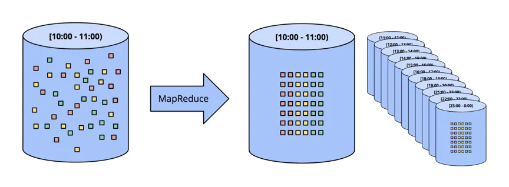
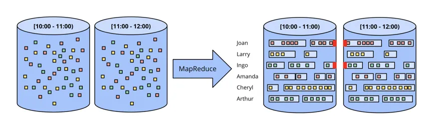
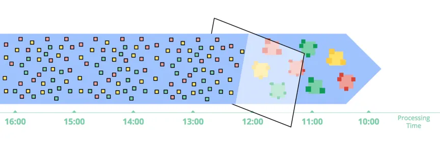
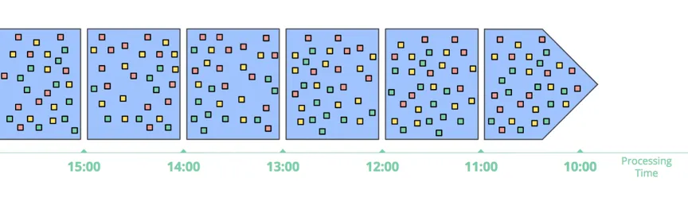

# 流数据处理的基础

资料源：https://www.oreilly.com/library/view/streaming-systems/9781491983867/

## 一、术语
‘流’特指：“流计算系统”，能处理无界数据集的数据处理系统。

现实世界中，需要处理各种类型的数据。有两个重要的（和正交的）维度定义了给定数据集的形状：基数（cardinality）和构成（constitution）。

- 基数：描述了数据集的大小，有两种精确的表达方式：
  - 有界数据：数据集大小固定
  - 无界数据：（理论上）数据集无限大
  
  其中如何处理无界数据，给数据处理系统带来了新的挑战。

- 构成：数据集的物理展现方式。两种非常重要的构成方式如下：
  - 表：某个时间点上，所有数据的快照。现存的数据库都是在处理表。
  - 流：随时间变化的数据集，从每个元素（变化）的视角看，得到的视图。基于MapReduce的系统都是在处理流。

接下来，首先会介绍以下时间域的基本概念，然后再深入看一下什么是在事件时间上的乱序和无界数据。之后再探究批和流系统，如何处理有界和无界数据。

## 二、事件时间 vs. 处理时间

必须对时间域有深刻的了解，才能正确的理解无界数据处理的理论。目前，对所有数据处理系统来说，有两个时间最关键：

- 事件时间：事件发生的时间
- 处理时间：事件流入系统的时间

理想世界里，事件时间=处理时间。也就是事件一发生就会立即被处理。但是在现实事件中，这是不可能发生的。很多因素都会导致事件时间和处理时间不一致，例如：

- 共享资源有限：网络带宽/CPU等限制
- 软件：分布式系统限制
- 数据本身的特性：比如主键分布或乱序等。

该图可以看出事件时间和处理时间关系的两个特点：

- 处理时滞：也就是处理时间一定比事件事件晚
- 事件时间偏差：处理时间-事件时间的时间差，并不固定。

因此，处理时间和事件时间，并没有关系。并且现实场景中，用户往往都是需要按照事件时间处理数据。然而现在很多流处理系统，为了简单，都是按处理时间，将无界数据进行切片，使其变为一个个小的有界数据片。这样做就会对真是结果产生误差。所以，为了保证最终结果的正确性，流系统一定要具备处理事件时间的能力。

然而要处理事件时间，又会产生其他问题，比如：如何判断事件时间X上的事件已经全部到齐？在现实世界中，是不可能做到的。因此我认为，不能再使用将无界数据切分成有界数据的方式来处理无界数据集了。好的流计算系统，就应该能够处理真实世界中复杂的数据，如果出现新数据，结果应该能够被自动更新或撤回。

在本文和接下来的一系列文章中，会着重讨论这种新型的流系统理论。在展开介绍这个理论之前，咱们先来看看目前数据处理的一般模式。

## 三、数据处理模式
### 1、有界数据
如何处理有界数据，大家都很熟悉了，如下图所示，左边的数据，经过某种数据处理引擎，变成右边的结构化数据集。

这个模型能处理的场景非常多，但是模型本身确非常简单。与之相比，处理无界数据的处理方式，更为复杂。我们先从典型的批处理系统开始，再到专门为流计算设计的系统为止，来逐步揭开流处理系统演进的步骤。

### 2、无界数据：批
传统的批处理引擎，通过切片的方式，将无界数据流，切分成一个个有界数据集，再进行计算。

#### 2.1 固定窗口
最常用的切片方式，是将数据切成固定大小的窗口（也叫滚窗），然后对每个窗口中的数据进行处理。这种方式对源头数据在事件时间上有序的场景是有用的。比如已经被切分成文件的日志等。

在现实世界中，绝大部分场景还是要处理数据完整性问题，无法保证数据到达流计算系统时，事件时间上保序。因此必须有机制能够使这些迟到的数据重新计算，才能保证结果的正确性（比如，等到所有事件都到再进行计算，或者，拿到晚到数据时，重新对某个小窗口的数据进行计算）

### 2.2 会话（SESSION）
用会话这种更复杂的窗口策略，用批处理系统处理无界数据，处理过程更复杂。首先了解下什么是会话窗口（session window）。会话窗口的典型定义是被隔开的一系列连续的活动。比如，某个用户1分钟内连续来了多次用户点击事件，等了3分钟，又来了几个连续的点击事件，则每次连续的点击事件，都是一个会话窗口。两个会话窗口的间隔是3分钟。

在批处理中，每个窗口的数据，可能分布在两个小批中。如下图红色区域所示。可以通过增大每批数据条数，来减少被阶段的会话窗口，但是会增加延时。当然也可以在分批的时候，把同一会话窗口的数据都分在一批，但这会大大增加系统设计的复杂度。

无论何种方式，用传统批处理来处理会话窗口的效果都不好。更优雅的方式是用流系统来处理会话窗口。

### 3、无界数据：流
流计算系统是转为处理无界数据而生的。真实的数据具有以下几个特点：

- **事件时间高度无序**：在事件时间上，高度无序。如果用户需要按照事件事件顺序分析数据，就需要在时间上做某种数据shuffle
- **事件时间偏差不固定**：也就是不能指望说在某段时间内，事件时间X的数据都会到齐。

处理以上特点的数据的方式，分为4类，接下来我们分别了解一下各种处理方式：
#### 3.1 时间无关

  某些场景中，数据的处理与时间无关。在这种场景中，批系统和流系统都可以处理这种场景，并且在结果上没有太大差别，接下来看几个时间无关处理的例子。
  - **过滤（Filter）**

    一个非常典型的与时间无关的操作就是过滤。比如要过滤某个网站的点击日志，把从某个domain来的都过滤掉，那这个操作跟数据的有界/无界/事件时间偏差都没有关系。
    

  - 内关联（Inner Joins）

    当两条流做内关联时，需要把两条流的数据都持久化到状态中。当两边的数据join上时，就输出。当然这种方式要考虑数据buffer大小的问题，一般都会按时间来配数据过期策略。
    
    在Join的时候，也有数据完整性问题，一条流中的数据到了，你怎么知道另一条流相应的数据是否到了？实际上，没人能回答这个问题。在实际使用过程中，必须要引入时间的概念。

  - 近似算法（Approximation algorithms）

    之前有很多人尝试用近似算法来解决流计算问题，比如近似TopN算法，流式K-means算法等。通过近似算法对无界数据进行计算，性能很好，但是可扩展性差，因为算法都太复杂了。

    这些算法中通常都基于处理时间，对事件进行处理，所以无法应对基于事件时间处理的需求。基于这个原因，其实近似算法是另一种形式的“时间无关型”操作。

    

### 4、窗口（Windowing）
其余两种流计算中常用的处理无界数据的方式，都是窗口的变体。简单来说，窗口是获得（有界或无界）数据源的概念，窗口将数据源沿着时间边界，切分成有界的数据块，然后对各个数据块进行处理。下图表示了三种窗口类型：

- **固定窗口（Fixed Window）**：又称为滚窗（Tumbling Window）

    固定窗口在时间维度上，按照固定长度将无界数据流切片，是一种对齐窗口。

- **滑动窗口（Sliding Window）**：又称为Hop Window

    是固定窗口的推广。由窗口长度和窗口间隔两个参数确定。如果窗口长度小于窗口间隔，那么两个窗口会重合，如上图中Sliding Window所示。如果窗口长度等于窗口间隔，那么就是固定窗口。如果窗口长度小雨窗口间隔，那么就会是一个比较奇怪的采样窗口，也就是仅对数据集的某些数据做窗口。

- **会话窗口（Session）**：

    是一种动态窗口。会话窗口由一系列事件序列组成，两个会话窗口之间由没有任何事件的一段时间间隔。比如，某个用户1分钟内连续来了多次用户点击事件，等了3分钟，又来了几个连续的点击事件，则每次连续的点击事件，都是一个会话窗口。两个会话窗口的间隔是3分钟。会话窗口通常通过将一系列临时相关的事件聚合，来分析用户行为。每个会话窗口的大小都是不固定的，窗口间的间隔也是不固定的。是一种非常典型的非对齐窗口。

Window可作用于**事件时间**和**处理时间**两个时间域。由于作用于处理时间更常见，我们先来讨论作用于处理时间的窗口。

#### 4.1 基于处理时间的窗口

基于处理时间的窗口，会把一段时间内的数据都缓存起来，直到时间结束。比如一个5分钟的窗口，系统会把这5分钟内的数据都缓存起来，5分钟时间到了，就将5分钟内的所有数据送到下游进行计算。

**基于处理时间的窗口有几个特性：**
- **简单**。使用和理解都非常简单，也不涉及数据晚到的问题。仅仅是将数据缓存一段时间再发到下游进行处理
- **能直观判断窗口是否结束**。没有所谓数据晚到的问题了。因为系统能够根据时间精确判断窗口是否结束。
- **如果要推断出数据源的某些信息，处理时间窗口非常合适**。许多监控类的需求都用这种窗口都比较合适。比如要计算一个全球范围的web服务的每秒的流量，来监控服务是否正常。

但是其他大部分场景中，需要依据事件时间来进行计算，用处理时间就不太合适了。比如要监控手机app的使用情况，但是在某段事件中，手机断网了，等联网之后，断网期间手机的运行数据才会被收集到。此时采集到数据的事件时间和处理时间是有很大偏差的。

现实情况中，很多类似以上情况的场景，都需要基于事件时间来处理。

#### 4.2 基于事件时间的窗口
基于事件时间的窗口是最标准的窗口。下图展示了一个基于事件时间的1小时固定窗口的例子，黑色箭头的两个数据是两个迟到数据：

[Windowing into fixed windows by event time]

数据根据发生的时间收集到窗口中。黑色箭头指出了到达处理时间窗口的示例数据，这些数据与它们所属的事件时间窗口不同。

要特别注意箭头中所示的两个数据，根据发生的时间收集到相应的事件窗口中，与它们所属的处理时间窗口不是同一个。因此如果基于处理时间的话，结果就是错的。只有基于事件时间进行计算，才能保证数据的正确性。

另外，基于事件时间窗口的好处是可以创建动态大小的窗口，比如会话窗口，避免出现上文“无界数据：批”章节例子中所提到的现象：
一个session窗口的数据，由于窗口大小固定，被切分到不同窗口中，对下游计算造成障碍。

[Windowing into session windows by event time]

上图展示了基于事件时间的会话窗口。基于事件发生的时间，数据被分到各个会话窗口中。黑色箭头表明了数据晚到，因此需要做数据shuffle将其放入正确的窗口中。

当然，虽然事件时间窗口功能很强大，但由于迟到数据的原因，窗口的存在时间比窗口本身的大小要长很多，导致的两个明显的问题是：

- **缓存**：

    事件时间窗口需要存储更长时间内的数据。庆幸的是，现在存储越来越便宜了。经过良好设计的系统，会有一层内存做缓存，其他的数据都持久化存储在更便宜的存储上。并且，很多聚合操作，如SUM/AVG等，可以做增量计算，并不需要保存所有数据。

- **完整性**：

    基于事件时间的窗口，我们也不能判断什么时候窗口的数据都到齐了。很多系统，如MillWheel，Flink通过watermark，能够推断一个相对精确的窗口结束时间。但是这种方式并不能得到完全正确的结果。因此，解决这个问题的更好的方式，应该是让用户能定义何时输出窗口结果，并且定义当迟到数据到来时，如何更新之前窗口计算的结果。

参考： https://developer.aliyun.com/article/674448?spm=a2c6h.12873639.article-detail.14.4b5960a4pR4h8X
