# ストリームデータ処理の基礎

資料源：https://www.oreilly.com/library/view/streaming-systems/9781491983867/

## 一、用語
「ストリーム」とは、特に「ストリーム処理システム」を指し、無限データセットを処理するデータ処理システムです。

現実の世界では、さまざまなタイプのデータを処理する必要があります。データセットの形状を定義する2つの重要な（かつ直交する）次元があります：基数（cardinality）と構成（constitution）。

- 基数：データセットのサイズを説明します。2つの正確な表現方法があります：
    - 有界データ：データセットのサイズが固定されている
    - 無界データ：（理論的には）データセットが無限大である

  無界データをどのように処理するかが、データ処理システムに新たな課題をもたらします。

- 構成：データセットの物理的な表現方法。2つの非常に重要な構成方法は以下の通りです：
    - テーブル：ある時点でのすべてのデータのスナップショット。現存するデータベースはすべてテーブルを処理しています。
    - ストリーム：時間とともに変化するデータセット。各要素（変化）の観点から得られるビュー。MapReduceベースのシステムはすべてストリームを処理しています。

次に、まずは時間ドメインの基本概念について説明し、その後イベントタイムでの乱序と無界データについて詳しく見ていきます。その後、バッチとストリームシステムが有界と無界データをどのように処理するかについて探ります。

## 二、イベントタイム vs. 処理タイム

無限データ処理の理論を正しく理解するためには、時間ドメインについて深く理解する必要があります。現在、すべてのデータ処理システムにおいて最も重要な2つの時間は以下の通りです：

- イベントタイム：イベントが発生した時間
- 処理タイム：イベントがシステムに流入した時間

理想的な世界では、イベントタイム＝処理タイムです。つまり、イベントが発生するとすぐに処理されるべきですが、現実のイベントではこれは不可能です。多くの要因がイベントタイムと処理タイムの不一致を引き起こします。例えば：

- 共有リソースの制限：ネットワーク帯域幅/CPUなどの制限
- ソフトウェア：分散システムの制限
- データ自体の特性：例えば、主キーの分布や乱序など。
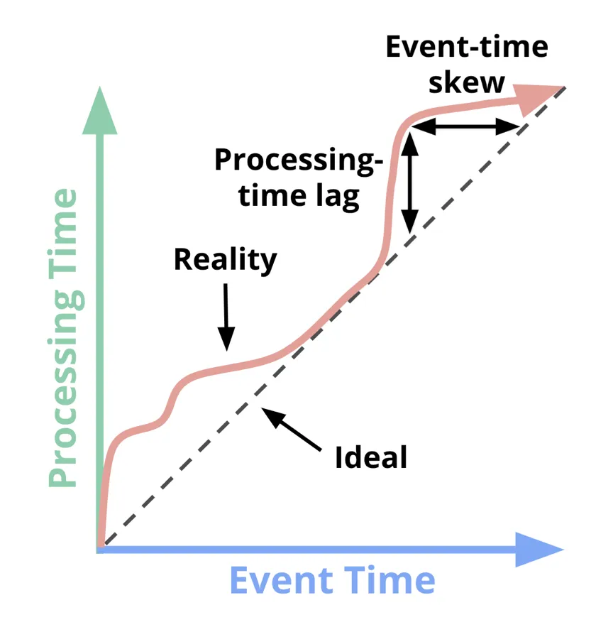

この図から、イベントタイムと処理タイムの関係には次の2つの特徴が見て取れます：

- 処理遅延：つまり、処理タイムは常にイベントタイムより遅れます。
- イベントタイムの偏差：処理タイムとイベントタイムの時間差は一定ではありません。

したがって、処理タイムとイベントタイムは無関係です。また、現実のシナリオでは、ユーザーはイベントタイムに基づいてデータを処理することを求めることが多いです。しかし、多くのストリーム処理システムでは、単純化のために処理タイムに基づいて無限データをスライスし、いくつかの小さな有界データ片に変換しています。このようにすると、実際の結果に誤差が生じます。したがって、最終結果の正確性を保証するためには、ストリームシステムはイベントタイムを処理する能力を備えている必要があります。

しかし、イベントタイムを処理するには他の問題が発生します。例えば、イベントタイムXでのイベントがすべて揃っているかどうかをどのように判断するかです。現実の世界では、これを正確に行うことは不可能です。したがって、無限データセットを有界データに分割する方法を使用することはできません。優れたストリーム計算システムは、現実世界の複雑なデータを処理できるべきであり、新しいデータが到着した場合、結果が自動的に更新または撤回されるべきです。

この記事とその後の一連の記事では、この新しいタイプのストリームシステム理論について詳しく説明します。理論を紹介する前に、現在のデータ処理の一般的なパターンを見ていきましょう。

## 三、データ処理モデル
### 1、有限データ
有限データの処理方法は広く知られており、下図のように、左側のデータは特定のデータ処理エンジンを経て、右側の構造化データセットに変換されます。

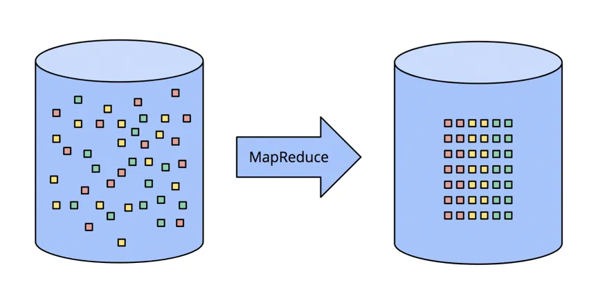

このモデルは多くのシーンで使用可能ですが、モデル自体は非常にシンプルです。それに対して、無限データの処理方法はより複雑です。典型的なバッチ処理システムから始まり、ストリーム処理専用に設計されたシステムに至るまで、ストリーム処理システムの進化のステップを段階的に見ていきます。

### 2、無限データ：バッチ
従来のバッチ処理エンジンは、スライスの方式で無限データストリームを有界データセットに分割し、その後に計算を行います。

#### 2.1 固定ウィンドウ
最も一般的なスライス方法は、データを固定サイズのウィンドウ（ロールウィンドウとも呼ばれる）に分割し、各ウィンドウ内のデータを処理する方法です。この方法は、ソースデータがイベントタイムで整列しているシーンで有効です。例えば、ファイルに分割されたログなどです。

現実の世界では、ほとんどのシーンでデータの完全性問題を処理する必要があり、データがストリーム処理システムに到達する際にイベントタイムが保証されることはありません。したがって、遅れて到着したデータを再計算するメカニズムが必要であり、結果の正確性を保証するためには、すべてのイベントが到着するのを待って計算するか、遅れて到着したデータを受け取った際に、小さなウィンドウのデータを再計算する必要があります。
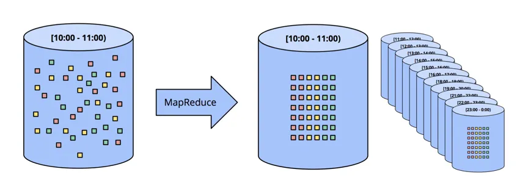

### 2.2 セッション（SESSION）
セッションというより複雑なウィンドウ戦略を用いてバッチ処理システムで無限データを処理するのは、処理がさらに複雑になります。まず、セッションウィンドウ（session window）とは何かを理解しましょう。セッションウィンドウの典型的な定義は、間隔をおいて連続する一連のアクティビティです。例えば、あるユーザーが1分以内に複数回クリックイベントを行い、さらに3分待ってから再び連続するクリックイベントがあれば、それぞれの連続するクリックイベントが1つのセッションウィンドウを形成します。2つのセッションウィンドウの間隔は3分です。

バッチ処理では、各ウィンドウのデータは2つの小さなバッチに分散する可能性があります。下図の赤い領域に示されています。バッチあたりのデータ件数を増やすことで、分割されたセッションウィンドウを減らすことができますが、これにより遅延が増加します。もちろん、バッチ処理の際に同じセッションウィンドウのデータをすべて1つのバッチにまとめることもできますが、これによりシステム設計の複雑さが大幅に増します。

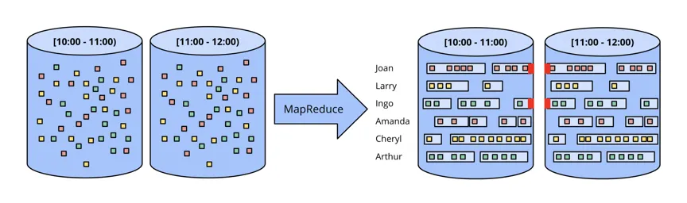

いずれの方法も、従来のバッチ処理でセッションウィンドウを処理するのは効果的ではありません。より優れた方法は、ストリームシステムを用いてセッションウィンドウを処理することです。

### 3、無限データ：ストリーム
ストリーム処理システムは無限データを処理するために生まれました。実際のデータには以下の特徴があります：

- **イベントタイムの高度な無秩序**：イベントタイム上で非常に無秩序です。ユーザーがイベントタイムの順序に従ってデータを分析する必要がある場合、時間的なデータシャッフルが必要です。
- **イベントタイムの偏差が固定ではない**：つまり、特定の期間内にイベントタイムXのデータがすべて揃うとは限りません。

これらの特徴を持つデータの処理方法は4つに分類されます。次に、それぞれの処理方法について詳しく見ていきましょう。

#### 3.1 時間に依存しない

いくつかのシーンでは、データ処理が時間に依存しないことがあります。このようなシーンでは、バッチシステムとストリームシステムの両方が処理でき、結果には大きな違いはありません。以下にいくつかの時間に依存しない処理の例を示します。

- **フィルタリング（Filter）**

  時間に依存しない典型的な操作の1つがフィルタリングです。たとえば、あるウェブサイトのクリックログから特定のドメインからのデータをフィルタリングする場合、この操作はデータの有界性/無界性やイベントタイムの偏差に関係ありません。
  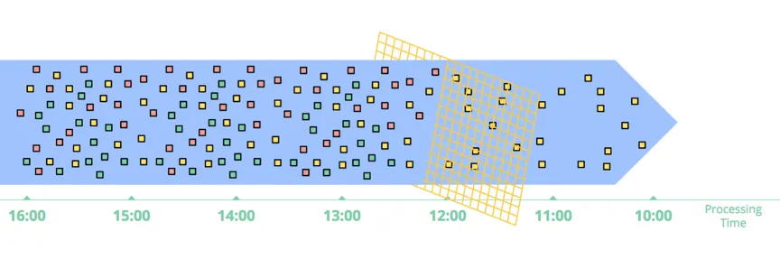

- **内部結合（Inner Joins）**

  2つのストリームを内部結合する場合、両方のストリームのデータを状態に永続化する必要があります。両側のデータが結合されると、結果が出力されます。ただし、この方法ではデータバッファのサイズの問題を考慮する必要があり、通常は時間に基づくデータの期限切れ戦略を設定します。
  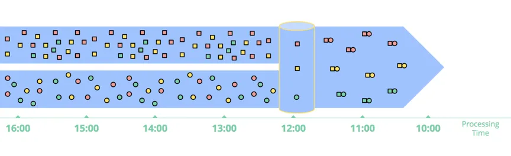
  結合時にはデータの完全性問題もあります。一方のストリームのデータが到着したとき、もう一方のストリームの対応するデータが到着したかどうかをどうやって確認するのでしょうか？実際には、この質問に対する答えはありません。実際の使用では、時間の概念を導入する必要があります。

- **近似アルゴリズム（Approximation algorithms）**

  以前、多くの人が流計算の問題を解決するために近似アルゴリズムを試みました。たとえば、近似TopNアルゴリズムやストリーミングK-meansアルゴリズムなどです。近似アルゴリズムは無限データに対して非常に良いパフォーマンスを提供しますが、アルゴリズムが非常に複雑であるため、スケーラビリティが低いです。

  これらのアルゴリズムは通常、処理時間に基づいてデータを処理するため、イベントタイムに基づく処理には対応できません。この理由から、近似アルゴリズムは別の形式の「時間に依存しない」操作と見なすことができます。

  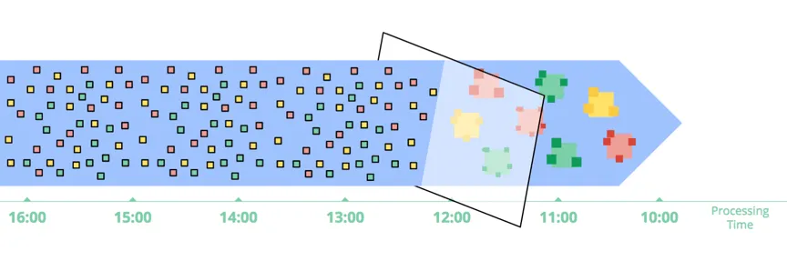

### 4、ウィンドウ（Windowing）

残りの2つの一般的なストリーム計算の無限データ処理方法は、ウィンドウの変種です。簡単に言うと、ウィンドウは（有限または無限の）データソースを取得する概念で、ウィンドウはデータソースを時間の境界に沿って切り分け、有界なデータブロックにし、それぞれのデータブロックを処理します。以下の図は、3つのウィンドウタイプを示しています。

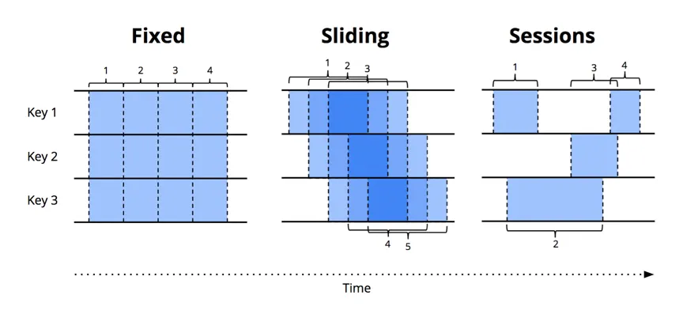

- **固定ウィンドウ（Fixed Window）**：別名ローリングウィンドウ（Tumbling Window）

  固定ウィンドウは時間軸に沿って一定の長さで無限データストリームをスライスします。これは整列ウィンドウです。

- **スライディングウィンドウ（Sliding Window）**：別名ホップウィンドウ（Hop Window）

  固定ウィンドウの拡張です。ウィンドウの長さとウィンドウの間隔の2つのパラメーターで決まります。ウィンドウの長さがウィンドウの間隔より小さい場合、2つのウィンドウが重なることになります。上の図のスライディングウィンドウのように、ウィンドウの長さがウィンドウの間隔と等しい場合、固定ウィンドウになります。ウィンドウの長さがウィンドウの間隔より小さい場合、比較的奇妙なサンプリングウィンドウとなり、データセットの一部のデータだけにウィンドウを適用します。

- **セッションウィンドウ（Session）**：

  動的なウィンドウです。セッションウィンドウは、一連のイベントシーケンスで構成され、2つのセッションウィンドウの間にはイベントのない時間間隔があります。たとえば、あるユーザーが1分内に連続して多くのユーザークリックイベントを送信し、3分後にさらに連続したクリックイベントが発生する場合、それぞれの連続したクリックイベントが1つのセッションウィンドウとなります。2つのセッションウィンドウの間隔は3分です。セッションウィンドウは通常、一連の一時的に関連するイベントを集約してユーザー行動を分析します。各セッションウィンドウのサイズは固定されておらず、ウィンドウ間の間隔も固定されていません。これは非常に典型的な非整列ウィンドウです。

ウィンドウは**イベント時間**と**処理時間**の2つの時間ドメインに適用できます。処理時間に適用することがより一般的であるため、まずは処理時間に適用されるウィンドウについて説明します。

#### 4.1 処理時間に基づくウィンドウ

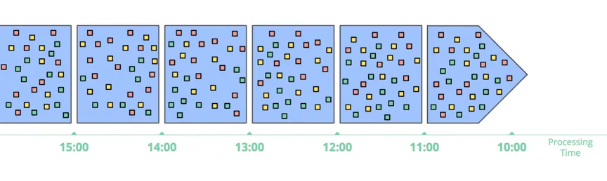

処理時間に基づくウィンドウでは、一定期間内のデータをすべてキャッシュし、その時間が終了するまで待機します。たとえば、5分間のウィンドウの場合、システムはその5分間のデータをすべてキャッシュし、5分が経過した時点でその5分間のすべてのデータを下流に送信して処理を行います。

**処理時間に基づくウィンドウの特性：**
- **シンプル**。使用と理解が非常に簡単で、データの遅延問題も関与しません。単にデータを一定期間キャッシュしてから下流に送信して処理します。
- **ウィンドウの終了を直感的に判断できる**。データの遅延問題がないため、システムは時間に基づいてウィンドウの終了を正確に判断できます。
- **データソースの情報を推測する場合に適している**。多くの監視関連の要求にはこのウィンドウが適しています。たとえば、グローバルなウェブサービスの毎秒のトラフィックを計算してサービスの正常性を監視する場合などです。

しかし、他の多くのシーンではイベント時間に基づいて計算する必要があります。処理時間だけでは適切に対処できない場合があります。たとえば、携帯アプリの使用状況を監視する場合、特定の期間中に携帯がオフラインになっていたが、再接続後にその間のデータが収集されると、データのイベント時間と処理時間には大きなズレが生じます。

現実的には、多くのこのような状況では、イベント時間に基づいて処理する必要があります。

#### 4.2 イベント時間に基づくウィンドウ
イベント時間に基づくウィンドウは、最も標準的なウィンドウです。以下の図は、イベント時間に基づく1時間の固定ウィンドウの例を示しており、黒い矢印で示された2つのデータは2つの遅延データです：

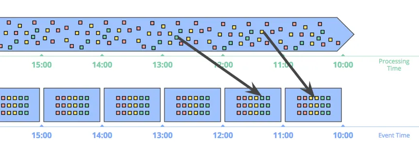

[Windowing into fixed windows by event time]

データは発生時間に基づいてウィンドウに収集されます。黒い矢印は処理時間ウィンドウに到達したデータの例を示しており、これらのデータはそれぞれのイベント時間ウィンドウとは異なります。

矢印で示された2つのデータに特に注意してください。これらは発生時間に基づいて対応するイベント時間ウィンドウに収集されており、処理時間ウィンドウとは一致していません。したがって、処理時間に基づいて計算すると結果が誤ってしまいます。データの正確性を保証するには、イベント時間に基づいて計算する必要があります。

さらに、イベント時間に基づくウィンドウの利点は、セッションウィンドウのような動的サイズのウィンドウを作成できる点です。これにより、前述の「無界データ：バッチ」章の例で述べたような現象を回避できます：
セッションウィンドウのデータはウィンドウサイズが固定されているため、異なるウィンドウに分割され、下流の計算に障害を引き起こします。

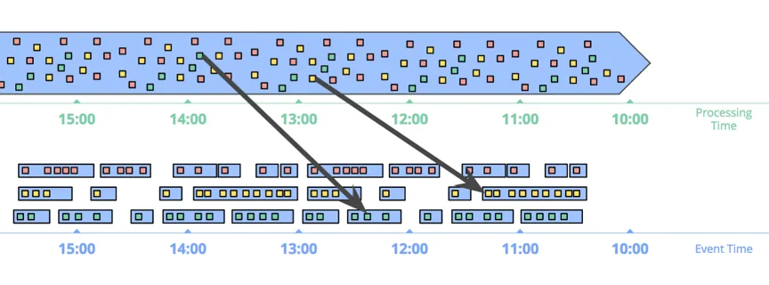

[Windowing into session windows by event time]

図は、イベント時間に基づくセッションウィンドウを示しています。イベント発生時間に基づいて、データは各セッションウィンドウに分配されます。黒い矢印は、データが遅れて到着し、そのためにデータシャッフルを行って正しいウィンドウに配置する必要があることを示しています。

もちろん、イベント時間ウィンドウの機能は非常に強力ですが、遅延データの影響でウィンドウの存在時間がウィンドウ自体のサイズよりもはるかに長くなるため、以下の2つの明らかな問題が発生します：

- **キャッシュ**：

  イベント時間ウィンドウは、より長い期間のデータを保存する必要があります。幸いなことに、現在のストレージはますます安価になっています。適切に設計されたシステムでは、メモリのキャッシュレイヤーがあり、他のデータはより安価なストレージに永続化されます。また、SUM/AVGなどの多くの集約操作は増分計算が可能であり、すべてのデータを保存する必要はありません。

- **完全性**：

  イベント時間に基づくウィンドウでは、ウィンドウ内のデータがすべて揃ったかどうかを判断することはできません。多くのシステム、例えばMillWheelやFlinkは、watermarkを使用して相対的に正確なウィンドウ終了時間を推測できます。しかし、この方法では完全に正確な結果を得ることはできません。したがって、この問題を解決するためのより良い方法は、ユーザーがウィンドウ結果の出力タイミングを定義し、遅延データが到着したときにどのように以前のウィンドウ計算結果を更新するかを定義できるようにすることです。

