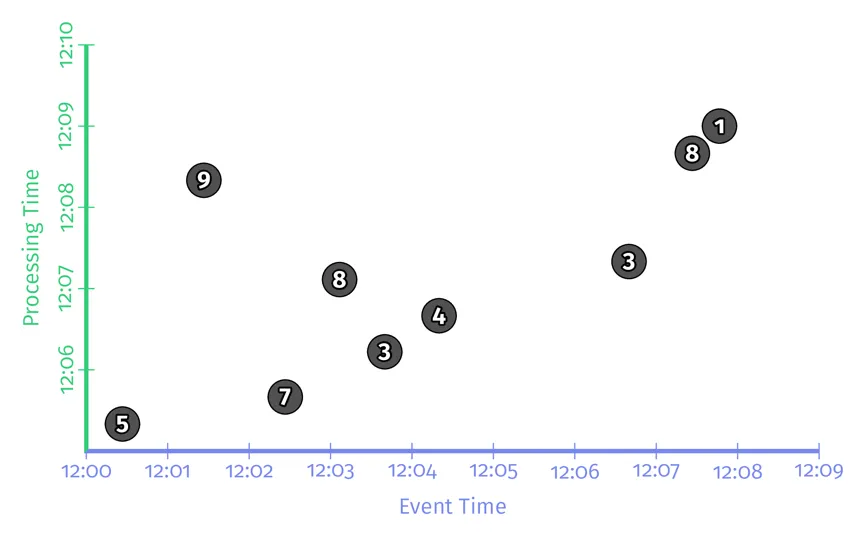
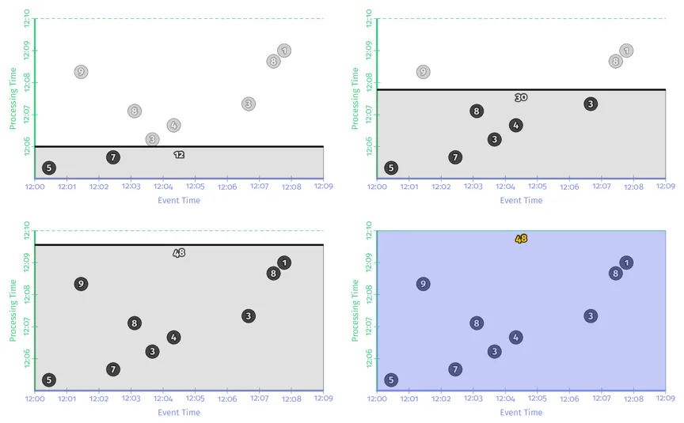
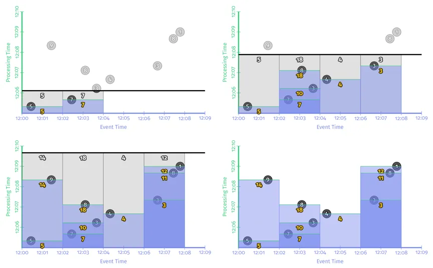
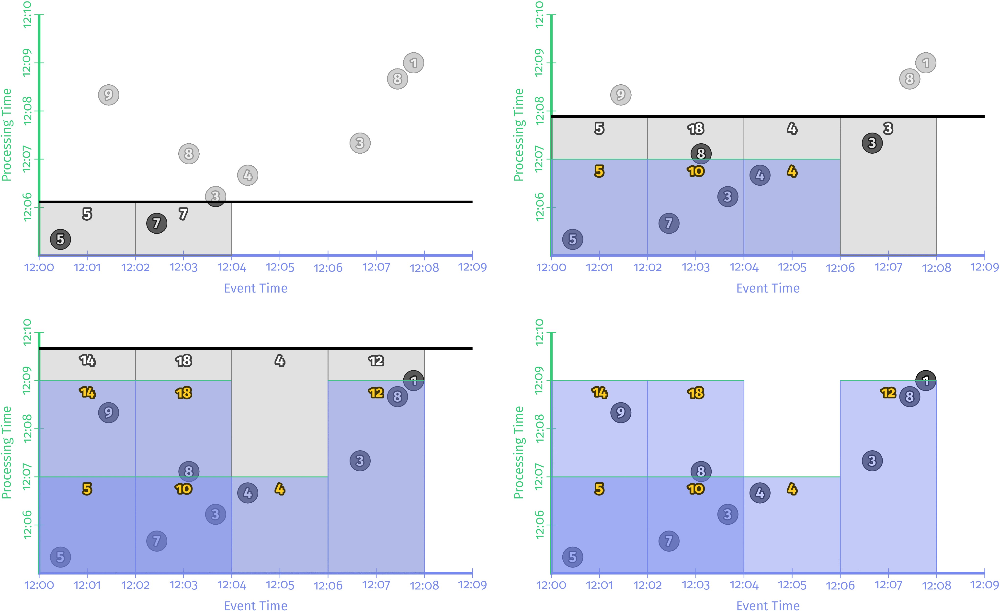
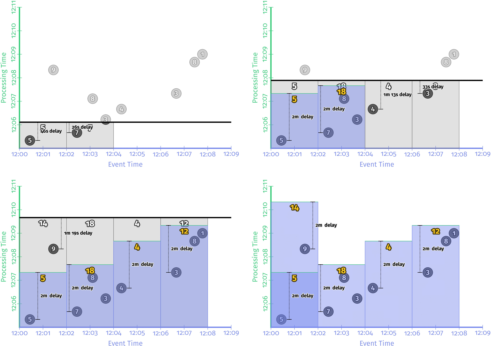
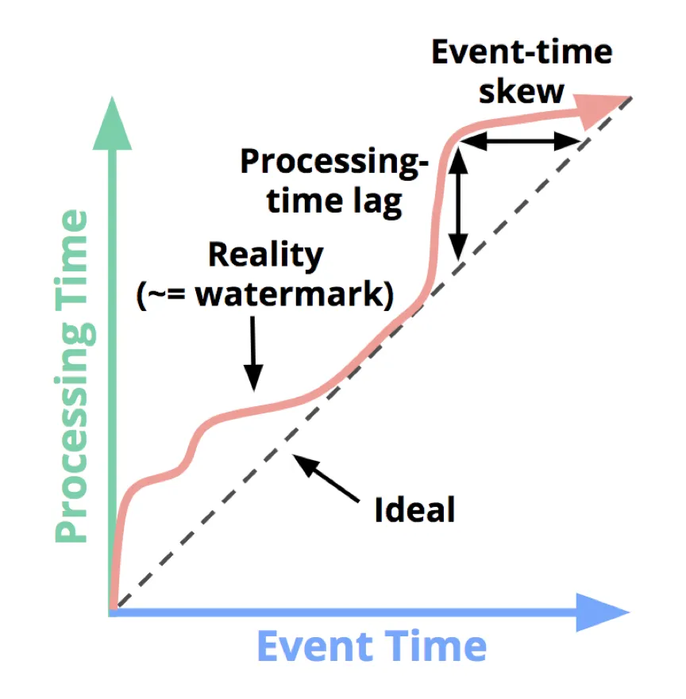
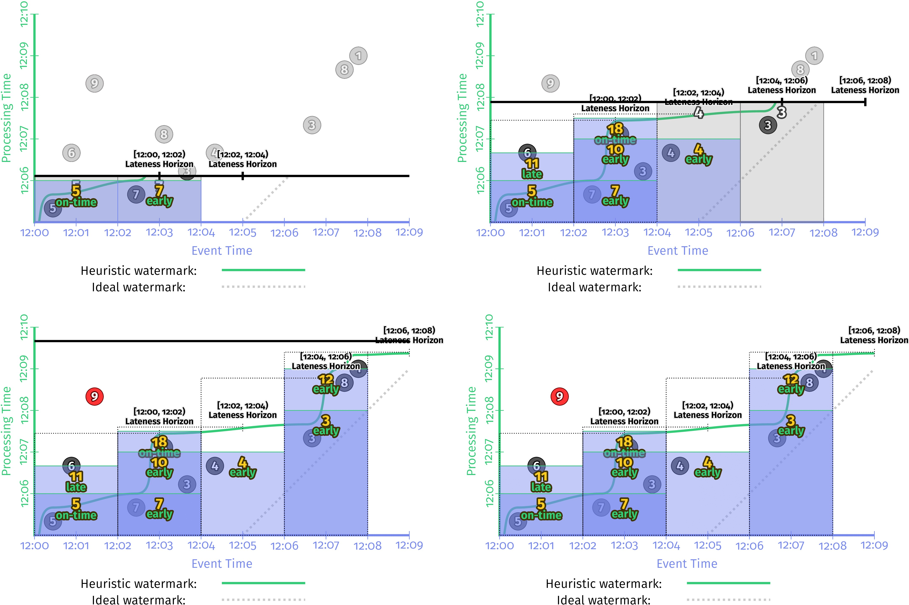

# What-Where-When-How of Data Processing

资料源：https://www.oreilly.com/library/view/streaming-systems/9781491983867/

本文主要介绍下面三个同样非常重要的概念：
- **触发器（Triggers）**

    触发器是决定某个窗口何时输出的一种机制。作用跟照相机的快门相同，按下去，就能拿到某个时间点计算结果的快照。通过触发器，也能多次看到某个窗口的输出结果。因此可以实现迟到数据（late event）的处理。
- **Watermark（水印）**

    Watermark是描述事件时间上数据完整性的概念。时间点X上的Watermark表示了所有时间点X前的输入数据都到齐了。本节会粗浅的介绍一下watermark，第三章中会对watermark做深入解释。
- **Accumulation（累积）**
    
    累积模式表示了同一个窗口不同输出间的关系。这些结果间可能完全无关，比如该窗口不同时间的增量，也可能有重叠。不同的累积模式在语义和成本上都不同，要根据具体场景来选择合适的累积方式。

## 1、批处理的基础：What&Where

### 1.1 What: Transformations（变换）
**批处理**中，用变换（Transformations）解决“What results are calculated?”这个问题。

接下来用一个实例来说明。假设我们要算一次电子游戏比赛中，某一队的总得分。这个例子的特点：对输入数据，在主键上，进行求和计算。具体数据如下：

**各列数据含义：**
- Score：队中每个队员得分
- EventTime：队员得分时间
- ProcTime：数据进入系统进行计算的时间

对数据以EventTime和ProcessTime作图，如下所示：

用Beam伪代码来实现这个示例，如果之前用过Flink或Spark，那么代码理解起来应该相对简单。首先介绍一下Beam的基本知识，Beam中有两类基本操作：

- PCollections：可以被并发处理的数据集（可能是海量的）
- PTransforms：对数据集进行的操作。比如group/aggregate等，读入PCollection并产生新的PCollection。

~~~
PCollection<String> raw = IO.read(...);
//Key为Team属性，value是score
PCollection<KV<String, Integer>> input = raw.apply(ParDo.of(new ParseFn());
PCollection<KV<String, Integer>> scores = input.apply(Sum.integersPerKey());
~~~

通过一个时序图来看看以上代码是如何处理这些数据的：

图中，X轴是EventTime，Y轴是Processing Time，黑色的线表示随着时间推移对所有数据进行计算，前三幅图白色的数字（12，30，48）为该processing time时间点上，计算的中间结果，在批处理中，这些中间结果会被保存下来。
最后一幅图是指整个计算完整个数据集之后，输出最终结果48。这就是整个经典批处理的处理过程。
由于数据是有界的，因此在process time上处理完所有数据后，就能得到正确结果。但是如果数据集是无界数据的话，这样处理就有问题。接下来我们讨论"Where in event time are results calculated?"这个问题。

### 1.2 Where: Windowing

在Beam中处理流数据时，通过窗口将无界数据源沿着临时边界，切分成一个个有界数据块。
~~~
PCollection<KV<String, Integer>> scores = input
  .apply(Window.into(FixedWindows.of(Duration.standardMinutes(2))))
  .apply(Sum.integersPerKey());
~~~
理论上批数据是流数据的子集，因此Beam在模型层面对批流做了统一。通过时序图看一下在传统批处理引擎中，以上代码是如何执行的：

从时序图上可以看出，在事件时间上，以2分钟为步长，将数据切分到不同的窗口。然后每个窗口的输出进行累加就得到最终结果。

_以上回顾了时间域（事件时间和处理时间的关系）和窗口的相关知识，接下来看一下触发器，watermark和accumulation这三个概念_

## 2、Streaming处理基础: When & How
批处理系统要等到所有数据都到齐才能输出计算结果，在无界数据流计算中是不可行的。因此流计算系统中引入了触发器（triggers）和watermark的概念。
在流出处理中，watermarks是描述事件时间上数据完整性的概念。触发器则是根据事件时间上的watermark来决定在处理时间的哪个时间点来输出窗口数据。

### 2.1 When: The wonderful thing about triggers, is triggers are wonderful things!
触发器解决了‘When in processing time are results materialized?’这个问题。触发器会根据事件时间上的watermark来决定，在处理时间的哪个时间点来输出窗口数据。每个窗口的输出称为窗口的窗格（pane of the window）。

**两种通用的最基础的trigger类型：**
- **重复更新触发器（Repeated update triggers）**: 
  定期触发窗口输出。比如每条数据都输出一个结果，或者在processing time上每隔一分钟输出一个结果。

- **完整性触发器（Completeness triggers）**:  
  仅当窗口的数据完整时，才输出窗口结果。跟传统批处理非常类似。只不过窗口的大小不同，传统批处理是要等整个数据集的数据都到齐，才进行计算。

重复更新触发器是最常用的触发器，因为其易于理解和使用，并且跟数据库中的物化视图语义非常相似。流计算中，完整性触发器的语义跟传统批处理更相似，能够处理late event。
Watermark是驱动Completeness Triggers被触发的原语。

先看个重复更新触发器的代码示例片段，它实现了每个元素都触发的功能：
~~~
PCollection<KV<String, Integer>> scores = input
  .apply(Window.into(FixedWindows.of(Duration.standardMinutes(2))
      .triggering(Repeatedly.forever(AfterPane.elementCountAtLeast(1)))
      .withAllowedLateness(Duration.standardDays(1000))
  .apply(Sum.integersPerKey());
~~~

在流计算系统中，其处理的时序图如下：

数据按事件时间被切分成了2分钟的固定窗口。每个窗口中，每来一条数据，窗口就触发一次计算并输出。用户能得到每个窗口中的最新的计算结果。

每个事件都触发计算的模式不适合在大规模数据量的情况下使用，系统的计算效率会非常低，并且会对下游系统造成很大的写压力。
一般情况下，在实际使用过程中，用户通常会在处理时间上定义一个延时，多长时间输出一次（比如每秒/每分钟等）。

触发器中，在处理时间延时上有两种方式：
- 对齐延时：将处理时间上切分成固定大小的时间片，对每个key的每个窗口，时间片大小都相同。
- 非对齐延时：延时时间与窗口内数据有关。

简单地讲，对齐延时就是按固定时间来触发计算。而非对齐延时，是按照数据进入系统的时间+延时时间触发计算。

**对齐延时的伪代码片段如下：**
~~~
 PCollection<KV<String, Integer>> scores = input.apply(Window.into(FixedWindows.of(Duration.standardMinutes(2))
      .triggering(Repeatedly.forever(AfterProcessingTime.pastFirstElementInPane().alignedTo(Duration.standardMinutes(2), Utils.parseTime("12:05:00"))))
      .withAllowedLateness(Duration.standardDays(1000))
      .accumulatingFiredPanes())
  .apply(Sum.integersPerKey());
~~~

上图表示，Process Time上，每两分钟各个窗口都输出一次数据。Spark streaming中micro-batch就是对齐延时的一种实现。好处是会定期输出结果。
缺点是如果数据有负载高峰，在tps很高的时候，系统的负载也会很高。会导致延时。

**非对齐延时的代码实现如下：**
~~~
PCollection<KV<String, Integer>> scores = input.apply(Window.into(FixedWindows.of(Duration.standardMinutes(2))
    .triggering(Repeatedly.forever(AfterProcessingTime.pastFirstElementInPane().plusDelayOf(Duration.standardMinutes(2))))
    .withAllowedLateness(Duration.standardDays(1000))
    .accumulatingFiredPanes())
.apply(Sum.integersPerKey());
~~~

上图中，每个Event Time窗口中，当窗口中有数据时，会在数据的Process Time上，被切成2min大小的数据块。
没有数据时，这个窗口是不进行计算的。每个窗口的输出时间是不同的。也就是所谓的每个窗口的输出‘非对齐’模式。
这种模式与对齐模式相比的好处是：在每个窗口上，负载更均衡。比如某个event time窗口中出现流量高峰，会立即进行计算输出结果，而不会依赖其他窗口的情况。
但最终，两种模式的延时是相同的。

**重复更新触发器使用和理解起来非常简单，但不能保证计算结果的正确性，无法处理late event。而Completeness triggers（完整性触发器）能解决这个问题。**

### 2.2 When: watermarks

Watermark标志着在Process Time上，何时应该输出结果。换句话说，watermark是某个event time窗口中所有数据都到齐的标志。一旦窗口的watermark到了，那么这个event time窗口里的数据就到齐了，可以进行计算了。

下图是event time和process time的关系。图中的红线就是watermark，它随着处理时间的推进捕捉着事件时间完整性的进度。Event Time和Process Time的关系可以表示为：F(P)->E，F这个函数就是watermark。换句话说可以将watermark视为着个函数，它接收一个处理时间点并返回一个事件时间点，事件时间点E是系统认为所有事件时间小于E的输入已经被观察到的点。
根据水印的类型（不论是完美的还是启发式的），这个断言可能是严格保证的，或者是有根据的猜测。

**两种类型的watermark：**
- **完美式水印（Perfect watermarks）**： 
  完美性watermark指，能够100%保证某个event time X之前的数据都到齐了，所有数据都很早或很准时到达，不会有late event。

- **启发式水印（Heuristic watermarks）**： 
  在真实世界无界数据的处理中，无法确切知道某个event time X之前的数据是否到齐。因此要用到启发式watermark。启发式watermark会根据某些条件推测X之前的数据已经到齐。
  但推测有可能是错的，有可能会有late event出现。我们将在下面的触发器部分了解处理延迟数据的方法。

  watermark标志着Event Time窗口中的数据是否完整，是Completeness triggers的基础。下面看个completeness triggers的示例代码：
~~~
PCollection<KV<String, Integer>> scores = input.apply(Window.into(FixedWindows.of(Duration.standardMinutes(2))
    .triggering(AfterWatermark.pastEndOfWindow()))
.apply(Sum.integersPerKey());
~~~

代码中watermark是个Function（AfterWatermark）。这个function可以有多种实现方式，比如如果能确切知道数据是否完整，就可以用Prefect Watermark。
如果不能，则要使用启发式watermark。

下图是在同一个数据集上使用两种不同的watermark的行为，左边是perfect watermark，右边是启发式的watermark。

在以上两种情况中，每次watermark经过event time窗口时，窗口都会输出计算结果。区别是perfect watermark的结果是正确的，但Heuristic watermark的结果是错误的，少了第一个窗口中‘9’这个数据。

在两个流的outer join场景中，如何判断输入数据是否完整？是否能做join？如果采用在process time上延时的重复更新型触发器进行计算，如果数据在event time有较大延时或者数据有乱序，那么计算结果就错了。在这种场景下，event time上的watermark对处理late event，保证结果正确性，就非常关键了。

没有完美的设计，**watermark也有两个明显的缺点**：
- **输出太慢：** 
  如果数据流中有晚到数据，越趋近于perfect watermark的watermark，将会一直等这个late event，而不会输出结果，这回导致输出的延时增加。
  如上图左边的一侧所示。在[12:00,12:02)这个窗口的输出，与窗口第一个元素的event time相比，晚了将近7分钟。对延时非常敏感的业务没办法忍受这么长的延时。
- **输出太快：** 
  启发式watermark的问题是输出太快，会导致结果不准。比如上图中右边一侧所示，对late event ‘9’，被忽略了。

因此，水印并不能同时保证无界数据处理过程中的低延时和正确性。既然重复更新触发器（Repeated update triggers）可以保证低延时，完整性触发器（Completeness triggers），能保证结果正确。那能不能将两者结合起来呢？

## 3、When: early/on-time/late triggers FTW!

如果将重复更新触发器（Repeated update triggers）和完整性触发器（Completeness triggers）的优势结合，即允许在watermark之前/之时/之后使用标准的重复更新触发器。
就产生了3种新的触发器：early/on-time/late trigger：
- **Zero or more early panes：** 
  在watermark经过窗口之前，即周期性的输出结果。这些结果可能是不准的，但是避免了watermark 输出太慢的问题。
- **A single on-time pane：** 
  仅在watermark通过窗口结束时触发一次。这时的结果可以看作是准确的。
- **Zero or more late panes：** 
  在watermark通过窗口结束边界之后，如果这个窗口有late event，也可以触发计算。这样就可以随时更新窗口结果，避免了输出太快导致的结果不对的问题。

在watermark的基础上，如果加一个1min的early firing trigger和一个每个record都会输出的late firing trigger，那么在event time上2min的窗口，使用1min的early firing trigger每隔一分钟就会输出一次，并且如果有late event，late firing trigger还能纠正之前窗口输出的结果。
这样保证了正确性的情况下，还不增加延时。
~~~
//Early, on-time, and late firings via the early/on-time/late API
PCollection<KV<String, Integer>> scores = input.apply(Window.into(FixedWindows.of(Duration.standardMinutes(2))
  .triggering(AfterWatermark.pastEndOfWindow()
          .withEarlyFirings(AfterProcessingTime.pastFirstElementInPane().plusDelayOf(Duration.standardMinutes(1)))
          .withLateFirings(AfterPane.elementCountAtLeast(1)))
  .withAllowedLateness(Duration.standardDays(1000))
  .accumulatingFiredPanes())
.apply(Sum.integersPerKey());
~~~
执行时序图如下：

由上如所示，加上了early firing trigger和late firing trigger后，完美型watermark和推断型watermark的结果就一致了。与没有加这两种trigger的实现相比，有了两点很明显的改进：

- **输出太晚（too slow）：** 
  在左侧perfect watermark的时序图中，第二个窗口[12:02,12:04)中，如果没有加early firing trigger，第一个数据‘7’发生的时间是12:02, 窗口的输出是12:09，第二个窗口的输出延时了近7分钟。加了early firing trigger之后，窗口第一次输出时间是12:06，提前了3分钟。上图右侧启发式watermark情况也非常类似。
- **输出太早（too fast）：** 
  第一个窗口[12:00,12:02)中，启发式窗口的watermark太早，late event ‘9’没有被算进去，加了late firing trigger之后，当'9'进入系统时，会触发窗口的再次计算，更正了之前窗口输出的错误结果，保证了数据的正确性。

完美型watermark和推断型watermark一个非常大的区别是，在完美型watermark例子中，当watermark经过窗口结束边界时，这个窗口里的数据一定是完整的，因此得出该窗口计算结果之后，就可以吧这个窗口的数据全部删除。
但启发式watermark中，由于late event的存在，为了保证结果的正确性，需要把窗口的数据保存一段时间。但其实我们根本不知道要把这个窗口的状态保存多长时间。
这就引出了一个新的概念：允许延时（allowed lateness）。

## 4、When: Allowed Lateness 
为了保证数据正确性，当late event到来后能够更新窗口结果，因此窗口的状态需要被持久化保存下来，但到底应该保存多长时间呢？实际生产环境中，由于磁盘大小等限制，某窗口的状态不可能无限的保存下去。
因此，定义窗口状态的保存时间为allowed lateness（允许的延迟）。也就是说，过了这个时间，窗口中数据会被清掉，之后到来的late event就不会被处理了。

**下面是一个带allowed lateness参数的例子：withAllowedLateness(Duration.standardMinutes(2))**
~~~
PCollection<KV<String, Integer>> scores = input.apply(Window.into(FixedWindows.of(Duration.standardMinutes(2))
  .triggering(AfterWatermark.pastEndOfWindow()
          .withEarlyFirings(AfterProcessingTime.pastFirstElementInPane().plusDelayOf(Duration.standardMinutes(1)))
          .withLateFirings(AfterPane.elementCountAtLeast(1)))
  .withAllowedLateness(Duration.standardMinutes(2))
  .accumulatingFiredPanes())
.apply(Sum.integersPerKey());
~~~~~~
执行时序图如下：

**关于allowed lateness的两个重点：**
- 如果数能够使用perfect watermark，即有序，则不需要考虑allowed lateness的问题
- 如果是对有限个key做全局聚合，则不必考虑allowed lateness问题。（因为部分全局聚合比如sum/agg等，可以做增量计算，不必要保存所有数据）

## 5、How: Accumulation
如果遇到late event，要如何修改窗口之前输出的结果呢？有三种方式：
- **Discarding（抛弃）：** 
  每个窗口产生输出之后，其state都被丢弃。也就是各个窗口之间完全独立。比较适合下游是聚合类的运算，比如对整数求和。
- **Accumulating（累积）：** 
  所有窗口的历史状态都会被保存，每次late event到了之后，都会触发重新计算，更新之前计算结果。这种方式适合下游是可更新的数据存储，比如HBase/带主键的RDS table等。
- **Accumulating & Retracting（累积&撤回）：** 
    Accumulating与第二点一样，即保存窗口的所有历史状态。撤回是指late event到来之后，出了触发重新计算之外，还会把之前窗口的输出撤回。 
    以下两个case非常适合用这种方式：
    - 如果窗口下游是分组逻辑，并且分组的key已经变了，那late event的最新数据下去之后，不能保证跟之前的数据在同一个分组，因此，需要撤回之前的结果。
    - 动态窗口中，由于窗口合并，很难知道窗口之前emit的老数据落在了下游哪些窗口中。因此需要撤回之前的结果。
  
以例子中第二个窗口[12:02,12:04)为例，我们分别看看三种模式的输出结果：

|                      | Discarding | Accumulating | Accumulating& Retracting |
|----------------------|------------|--------------|--------------------------|
| Pane 1: inputs=[7,3] | 10         | 10           | 10                       |
| Pane 2: inputs=[8]   | 8          | 18           | 18, -10                  |
| Last NormalValue     | 8          | 18           | 18                       |
| Total Sum            | 18         | 28           | 18                       |

1) Discarding（抛弃）：同一个窗口的每次输出，都与之前的输出完全独立。本例子中，要算求和的话，只需要把窗口的每次输出都加起来即可。因此Discarding 模式对下游是聚合（SUM/AGG）等场景非常何时。
2) Accumulating（累积）：窗口的会把之前所有state都保存，因此同一个窗口的每个输出，都是之前所有数据的累积值。本例子中，该窗口第一次输出是10，第二次输入是8，之前的状态是10，所以输出是18。如果下游计算直接把两次输出加起来，结果就是错的。
3) Accumulating & Retracting（累积&撤回）：窗口的每个输出，都有一个累积值和一个撤回值。本例中，第一次输出10，第二次输出的是[18,-10]，因此下游把窗口的所有输出求和，会减去之前的重复值，得到正确结果18.

~~~
//Discarding mode version of early/on-time/late firings
PCollection<KV<String, Integer>> scores = input.apply(Window.into(FixedWindows.of(Duration.standardMinutes(2))
  .triggering(AfterWatermark.pastEndOfWindow()
          .withEarlyFirings(AfterProcessingTime.pastFirstElementInPane().plusDelayOf(Duration.standardMinutes(1)))
          .withLateFirings(AfterPane.elementCountAtLeast(1)))
  .withAllowedLateness(Duration.standardDays(1000))
  .discardingFiredPanes())
.apply(Sum.integersPerKey());
~~~
使用启发式水印，在流计算引擎中，上述代码对应的时序图如下：

参考：https://developer.aliyun.com/article/674450?spm=a2c6h.13262185.profile.15.150a1fa7ZOi8rW 
