# What-Where-When-How of Data Processing

資料源：https://www.oreilly.com/library/view/streaming-systems/9781491983867/

本文は以下の3つの重要な概念について紹介します：
- **トリガー（Triggers）**

  トリガーは、あるウィンドウがいつ出力されるかを決定するメカニズムです。カメラのシャッターと同じ役割を果たし、押すと特定の時間の計算結果のスナップショットを取得できます。トリガーを使用すると、同じウィンドウの出力結果を複数回確認することができます。これにより、遅延データ（late event）の処理が可能になります。
- **Watermark（水印）**

  Watermarkは、イベント時間におけるデータの完全性を示す概念です。時点XのWatermarkは、時点X以前のすべての入力データが揃っていることを示します。本節ではWatermarkの基本的な説明を行い、第3章で詳細に解説します。
- **Accumulation（累積）**

  累積モードは、同じウィンドウ内の異なる出力の関係を表します。これらの結果は完全に無関係である場合もあれば、重複している場合もあります。異なる累積モードは、意味とコストの面で異なるため、具体的なシナリオに応じて適切な累積方法を選択する必要があります。

## 1、バッチ処理の基礎：What&Where

### 1.1 What: Transformations（変換）
**バッチ処理**では、変換（Transformations）を用いて「What results are calculated?」という問題を解決します。

次に例を用いて説明します。あるビデオゲームの試合で、特定のチームの総得点を計算する必要があるとします。この例の特徴：入力データに対して、主キーに基づいて合計を計算します。具体的なデータは以下の通りです：
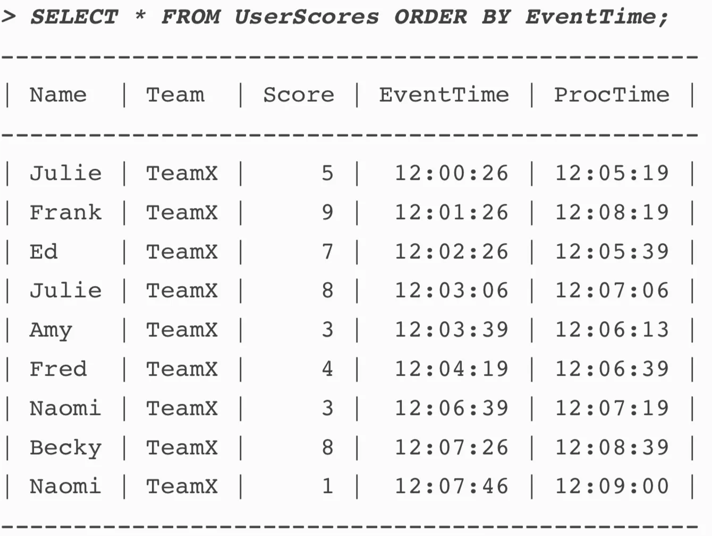

**各列のデータの意味：**
- Score：チームの各メンバーの得点
- EventTime：メンバーが得点した時間
- ProcTime：データがシステムに入力されて計算された時間

データをEventTimeとProcessTimeでプロットすると、以下のようになります：
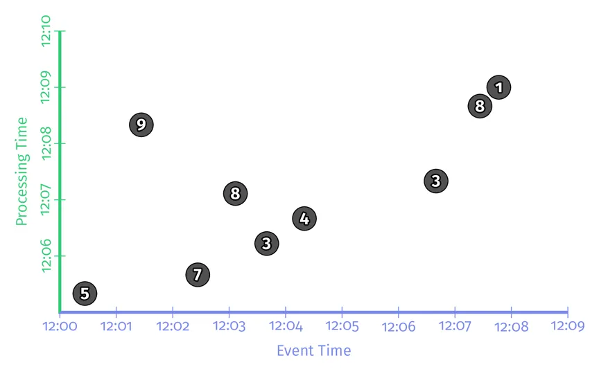

Beamの擬似コードを用いてこの例を実装します。以前にFlinkやSparkを使用したことがある場合、コードの理解は比較的簡単です。まず、Beamの基本知識を紹介します。Beamには2種類の基本操作があります：

- PCollections：並列処理が可能なデータセット（大量の可能性があります）
- PTransforms：データセットに対する操作。例えば、グループ化/集計など。PCollectionを読み込み、新しいPCollectionを生成します。

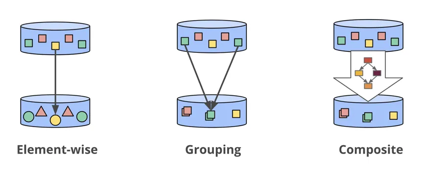
~~~
PCollection<String> raw = IO.read(...);
//KeyはTeam属性、valueはscore
PCollection<KV<String, Integer>> input = raw.apply(ParDo.of(new ParseFn());
PCollection<KV<String, Integer>> scores = input.apply(Sum.integersPerKey());
~~~

タイムラインを使って、これらのデータがどのように処理されるかを見てみましょう：

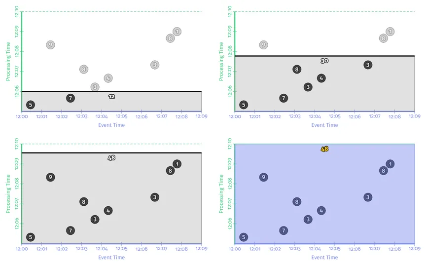

図では、X軸がEventTime、Y軸がProcessing Timeを表し、黒い線は時間の経過とともにすべてのデータを計算する様子を示しています。前の3つの図の白い数字（12、30、48）は、その時点で計算された中間結果を示しています。バッチ処理では、これらの中間結果は保存されます。
最後の図は、データセット全体の計算が完了した後の最終結果48を出力する様子を示しています。これが古典的なバッチ処理のプロセスです。
データが有限であるため、process timeが経過してすべてのデータが処理された後、正しい結果が得られます。しかし、データセットが無限データである場合、このような処理は問題があります。次に、"Where in event time are results calculated?"という問題について議論します。

### 1.2 Where: Windowing

Beamでストリーミングデータを処理する際には、無限データソースを一時的な境界に沿って有界データチャンクに分割するためにウィンドウを使用します。
~~~
PCollection<KV<String, Integer>> scores = input
  .apply(Window.into(FixedWindows.of(Duration.standardMinutes(2))))
  .apply(Sum.integersPerKey());
~~~
理論上バッチデータはストリームデータのサブセットであるため、Beamはモデルレベルでバッチとストリームを統一しました。時系列チャートを通じて、従来のバッチ処理エンジンで上記のコードがどのように実行されるかを見てみましょう：

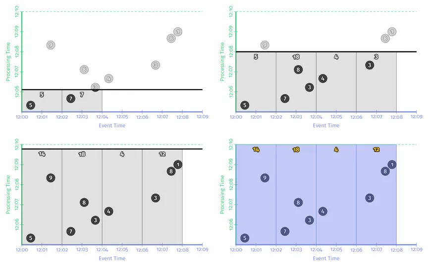

時系列チャートから、イベントタイムにおいて2分間隔でデータが異なるウィンドウに分割されていることがわかります。そして、各ウィンドウの出力を累積して最終結果が得られます。

_以上で時間領域（イベントタイムとプロセスタイムの関係）とウィンドウに関する知識を振り返りました。次に、トリガー、watermark、およびaccumulationの3つの概念を見ていきましょう。_

## 2、Streaming: When & How
バッチ処理システムでは、すべてのデータが揃うまで計算結果を出力することができませんが、これは無限データストリームの計算では不可能です。そのため、ストリーム処理システムにはトリガー（triggers）とwatermarkの概念が導入されました。

ストリーム処理において、watermarksはイベントタイム上のデータの完全性を表す概念です。トリガーはイベントタイム上のwatermarkに基づいて、プロセスタイムのどの時点でウィンドウデータを出力するかを決定します。

### 2.1 When: The wonderful thing about triggers, is triggers are wonderful things!

トリガーは「When in processing time are results materialized?」という問題を解決します。トリガーはイベントタイム上のwatermarkに基づいて、処理時間のどの時点でウィンドウデータを出力するかを決定します。各ウィンドウの出力はウィンドウのウィンドウペイン（pane of the window）と呼ばれます。

**2つの一般的な基本的なトリガータイプ：**
- **繰り返し更新トリガー（Repeated update triggers）**:
  定期的にウィンドウ出力をトリガーします。例えば、各データに対して結果を出力する場合や、プロセスタイムで1分ごとに結果を出力する場合などです。

- **完全性トリガー（Completeness triggers）**:
  ウィンドウのデータが完全なときのみ、ウィンドウ結果を出力します。従来のバッチ処理に非常に似ていますが、ウィンドウのサイズが異なります。従来のバッチ処理では、データセット全体のデータが揃ったときに計算を行います。

繰り返し更新トリガーは最も一般的に使用されるトリガーです。その理由は、理解しやすく、使用が簡単であり、データベースのマテリアライズドビューのセマンティクスと非常に似ているからです。ストリーム処理において、完全性トリガーのセマンティクスは従来のバッチ処理に非常に似ており、レイトイベントを処理することができます。
Watermarkは完全性トリガーを駆動する原語です。

まず、繰り返し更新トリガーのコード例を見てみましょう。これは、各要素がトリガーされる機能を実装しています：
~~~
PCollection<KV<String, Integer>> scores = input
  .apply(Window.into(FixedWindows.of(Duration.standardMinutes(2))
      .triggering(Repeatedly.forever(AfterPane.elementCountAtLeast(1)))
      .withAllowedLateness(Duration.standardDays(1000))
  .apply(Sum.integersPerKey());
~~~

ストリーム処理システムでの処理の時系列チャートは以下の通りです：

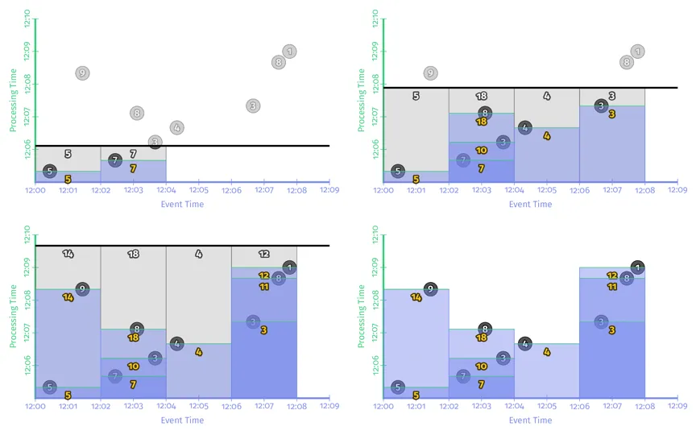

データはイベントタイムに基づいて2分間隔の固定ウィンドウに分割されます。各ウィンドウでは、データが到着するたびにウィンドウが一度計算をトリガーし、出力します。ユーザーは各ウィンドウ内の最新の計算結果を得ることができます。

すべてのイベントが計算をトリガーするモードは、大規模なデータ量の場合には適しておらず、システムの計算効率が非常に低く、下流システムに大きな書き込み圧力をかける可能性があります。
一般的には、実際の使用では、ユーザーは処理時間に遅延を定義し、どのくらいの間隔で出力するか（例えば、毎秒/毎分など）を設定します。

トリガーには、処理時間の遅延に対して2つの方式があります：
- **整列遅延（Aligned Delays）**: 処理時間を固定サイズのタイムスライスに分割し、各キーの各ウィンドウに対して、タイムスライスのサイズが同じです。
- **非整列遅延（Non-Aligned Delays）**: 遅延時間はウィンドウ内のデータに依存します。

簡単に言うと、整列遅延は固定の時間で計算をトリガーします。一方、非整列遅延は、データが【システムに入る時間】+【遅延時間】に基づいて計算をトリガーします。

**整列遅延の擬似コードの例は以下の通りです：**
~~~
 PCollection<KV<String, Integer>> scores = input.apply(Window.into(FixedWindows.of(Duration.standardMinutes(2))
      .triggering(Repeatedly.forever(AfterProcessingTime.pastFirstElementInPane().alignedTo(Duration.standardMinutes(2), Utils.parseTime("12:05:00"))))
      .withAllowedLateness(Duration.standardDays(1000))
      .accumulatingFiredPanes())
  .apply(Sum.integersPerKey());
~~~
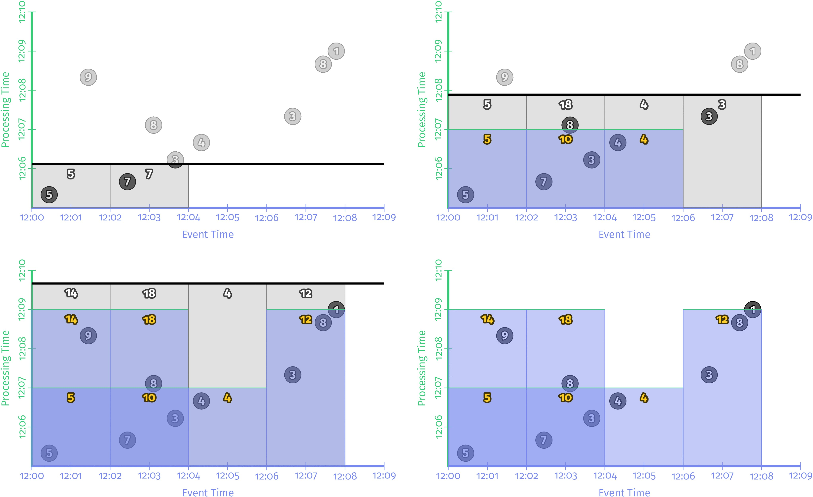

上の図は、プロセスタイムで各ウィンドウが2分ごとにデータを出力することを示しています。Spark Streamingのmicro-batchは、整列遅延の一例です。メリットは、定期的に結果が出力されることです。
デメリットは、データの負荷ピーク時、TPSが非常に高いときにシステムの負荷も高くなり、遅延が発生する可能性があることです。

**非整列遅延のコード実装は以下の通りです：**
~~~
PCollection<KV<String, Integer>> scores = input.apply(Window.into(FixedWindows.of(Duration.standardMinutes(2))
    .triggering(Repeatedly.forever(AfterProcessingTime.pastFirstElementInPane().plusDelayOf(Duration.standardMinutes(2))))
    .withAllowedLateness(Duration.standardDays(1000))
    .accumulatingFiredPanes())
.apply(Sum.integersPerKey());
~~~

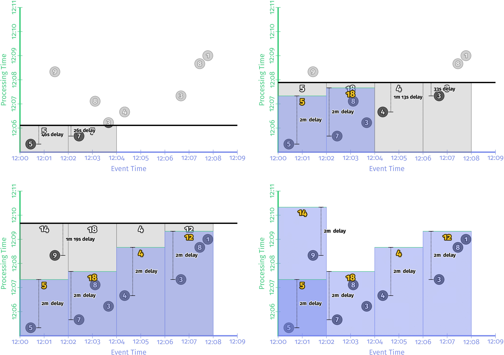

上の図では、各イベントタイムウィンドウで、ウィンドウ内にデータがある場合、データはプロセスタイムで2分サイズのデータブロックに分割されます。
データがない場合、そのウィンドウでは計算が行われません。各ウィンドウの出力時間は異なります。つまり、いわゆる各ウィンドウの出力は「非整列」モードです。
このモードのメリットは、整列モードと比較して、各ウィンドウでの負荷がより均衡することです。例えば、特定のイベントタイムウィンドウでトラフィックのピークが発生した場合、そのウィンドウはすぐに計算を行い結果を出力します。他のウィンドウの状況には依存しません。
しかし、最終的には、両方のモードの遅延は同じです。

**繰り返し更新トリガーは使用と理解が非常に簡単ですが、計算結果の正確性を保証することはできず、レイトイベントを処理することはできません。一方、Completeness triggers（完全性トリガー）はこの問題を解決することができます。**

### 2.2 When: watermarks

Watermarkはプロセスタイム上で結果を出力すべき時期を示します。言い換えれば、watermarkは特定のイベントタイムウィンドウ内のすべてのデータが揃ったことを示すマーカーです。一度ウィンドウのwatermarkに到達すると、そのイベントタイムウィンドウ内のデータは揃っており、計算が可能になります。

下の図はイベントタイムとプロセスタイムの関係を示しています。図中の赤い線がwatermarkで、処理時間が進むにつれてイベントタイムの完全性の進捗をキャッチしています。イベントタイムとプロセスタイムの関係は次のように表されます：F(P) -> E。ここで、Fはwatermarkという関数です。言い換えると、watermarkをこの関数として考えることができ、処理時間のポイントを受け取り、イベントタイムのポイントを返します。イベントタイムのポイントEは、システムがすべてのイベントタイムがEより小さい入力が観測されたと考えるポイントです。
水印のタイプ（完全なものかヒューリスティックなものか）に応じて、この主張は厳密に保証される場合もあれば、根拠に基づいた推測に過ぎない場合もあります。

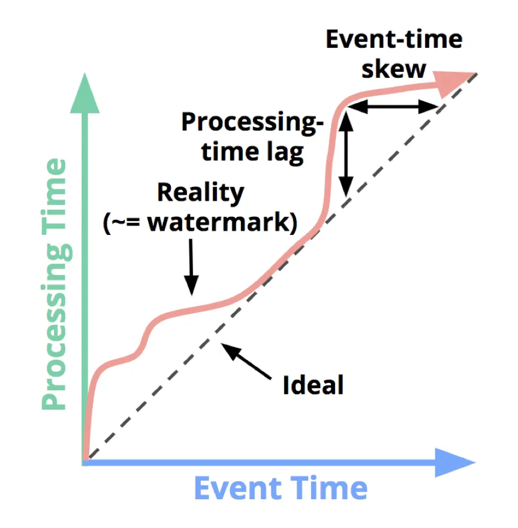

**2種類のwatermark：**
- **完璧な水印（Perfect watermarks）**： 
  完璧なwatermarkは、あるevent time X以前のデータがすべて到着していることを100%保証するもので、すべてのデータが非常に早く、または正確に到着し、late eventが存在しないことを意味します。

- **ヒューリスティック水印（Heuristic watermarks）**： 
  現実世界の無限データ処理においては、あるevent time X以前のデータがすべて到着しているかどうかを正確に知ることはできません。したがって、ヒューリスティックwatermarkが必要です。ヒューリスティックwatermarkは、いくつかの条件に基づいてX以前のデータが到着していると推測します。
  しかし、この推測が間違っている可能性があり、late eventが発生する可能性があります。遅延データの処理方法については、以下のトリガーの部分で説明します。

  watermarkはEvent Timeウィンドウ内のデータが完全であるかどうかを示し、Completeness triggersの基礎となります。以下はcompleteness triggersのサンプルコードです：

~~~
PCollection<KV<String, Integer>> scores = input.apply(Window.into(FixedWindows.of(Duration.standardMinutes(2))
    .triggering(AfterWatermark.pastEndOfWindow()))
.apply(Sum.integersPerKey());
~~~

コード内でwatermarkはFunction（AfterWatermark）です。このfunctionには複数の実装方法があります。例えば、データの完全性を正確に把握できる場合は、Perfect Watermarkを使用できます。
そうでない場合は、ヒューリスティックwatermarkを使用する必要があります。

下図は、同じデータセットで2種類の異なるwatermarkを使用した場合の動作を示しています。左側はperfect watermark、右側はヒューリスティックwatermarkです。

上記の2つのケースでは、watermarkがevent timeウィンドウを通過するたびにウィンドウが計算結果を出力します。違いは、perfect watermarkの結果は正しいですが、Heuristic watermarkの結果は間違っており、最初のウィンドウに含まれる「9」というデータが欠けています。

2つのストリームのouter joinシナリオでは、入力データが完全であるかどうかをどうやって判断しますか？joinを行うことができるのでしょうか？もしprocess timeで遅延した再更新型トリガーを使用して計算を行った場合、データにevent timeで大きな遅延がある場合やデータが乱序している場合、計算結果は間違ってしまいます。このようなシナリオでは、event timeでのwatermarkが遅延データの処理や結果の正確性を確保するために非常に重要です。

完璧な設計は存在しません。**watermarkにも2つの明らかな欠点があります**：
- **出力が遅すぎる：** 
  データストリームに遅延データがある場合、perfect watermarkに近づくほど、その遅延イベントを待ち続け、結果を出力しないため、出力遅延が増加します。上の図の左側に示されているように、[12:00,12:02)というウィンドウの出力は、ウィンドウの最初の要素のevent timeと比較して、ほぼ7分遅れています。遅延に非常に敏感なビジネスでは、これほどの遅延に耐えることはできません。

- **出力が速すぎる：** 
  ヒューリスティックwatermarkの問題は、出力が速すぎて結果が不正確になることです。例えば、上の図の右側に示されているように、遅延イベント「9」が無視されてしまいます。

そのため、watermarkは無限データ処理プロセスにおいて低遅延と正確性の両方を同時に保証することはできません。再更新トリガー（Repeated update triggers）は低遅延を保証し、完全性トリガー（Completeness triggers）は結果の正確性を保証します。それでは、これら2つを組み合わせることは可能なのでしょうか？

## 3、When: early/on-time/late triggers FTW!

**2つのタイプのwatermark：**
- **完全水印（Perfect watermarks）**：
  完全水印は、特定のイベントタイムX以前のデータがすべて揃っていることを100%保証します。すべてのデータが早期または正確に到着し、レイトイベントが発生しないことを意味します。

- **ヒューリスティック水印（Heuristic watermarks）**：
  現実の無限データ処理では、特定のイベントタイムX以前のデータが確実に揃っているかどうかを正確に知ることはできません。そのため、ヒューリスティック水印が使用されます。ヒューリスティック水印は、いくつかの条件に基づいてX以前のデータが揃っていると推測します。
  しかし、この推測が間違っている可能性があり、レイトイベントが発生する可能性があります。レイトデータの処理方法については、以下のトリガー部分で詳しく見ていきます。

watermarkはイベントタイムウィンドウ内のデータが完全かどうかを示し、完全性トリガーの基盤となります。以下に完全性トリガーのサンプルコードを示します：
~~~
//Early, on-time, and late firings via the early/on-time/late API
PCollection<KV<String, Integer>> scores = input.apply(Window.into(FixedWindows.of(Duration.standardMinutes(2))
  .triggering(AfterWatermark.pastEndOfWindow()
          .withEarlyFirings(AfterProcessingTime.pastFirstElementInPane().plusDelayOf(Duration.standardMinutes(1)))
          .withLateFirings(AfterPane.elementCountAtLeast(1)))
  .withAllowedLateness(Duration.standardDays(1000))
  .accumulatingFiredPanes())
.apply(Sum.integersPerKey());
~~~
実行時の時系列チャートは以下の通りです：

上のように、early firing triggerとlate firing triggerを追加すると、完璧型watermarkとヒューリスティック型watermarkの結果は一致します。これらの2つのトリガーを追加することで、以下の2点が明らかに改善されます：

- **出力が遅すぎる（too slow）：**
  左側の完璧型watermarkの時系列チャートでは、第二ウィンドウ[12:02,12:04)で、early firing triggerがない場合、最初のデータ「7」の発生時間は12:02で、ウィンドウの出力は12:09です。第二ウィンドウの出力は約7分遅れています。early firing triggerを追加すると、ウィンドウの最初の出力時間が12:06となり、3分早くなります。右側のヒューリスティックwatermarkの場合も非常に似ています。

- **出力が早すぎる（too fast）：**
  最初のウィンドウ[12:00,12:02)で、ヒューリスティック型ウィンドウのwatermarkが早すぎて、レイトイベント「9」が計算に含まれていません。late firing triggerを追加すると、「9」がシステムに入るとウィンドウの再計算がトリガーされ、以前のウィンドウ出力の誤った結果が修正され、データの正確性が保証されます。

完璧型watermarkとヒューリスティック型watermarkの大きな違いは、完璧型watermarkの例では、watermarkがウィンドウの終了境界を通過すると、そのウィンドウ内のデータが必ず完全であるため、そのウィンドウの計算結果が得られた後は、ウィンドウ内のデータをすべて削除できます。
しかし、ヒューリスティック型watermarkでは、レイトイベントの存在により、結果の正確性を保証するためにウィンドウのデータをしばらく保存する必要があります。ただし、このウィンドウの状態をどれだけの時間保存すべきかは実際にはわかりません。
これが新しい概念「許容遅延（allowed lateness）」を導入することになります。

## 4、When: Allowed Lateness
データの正確性を保証するために、レイトイベントが到着した後にウィンドウ結果を更新できるように、ウィンドウの状態は持続的に保存する必要がありますが、どのくらいの時間保存すべきかは問題です。実際の運用環境では、ディスクの容量などの制限により、ウィンドウの状態を無限に保存することはできません。
したがって、ウィンドウの状態を保存する時間を「許容遅延（allowed lateness）」として定義します。つまり、この時間を過ぎると、ウィンドウ内のデータは削除され、その後に到着するレイトイベントは処理されなくなります。

**以下はallowed latenessパラメータを指定する例です：withAllowedLateness(Duration.standardMinutes(2))**
~~~
PCollection<KV<String, Integer>> scores = input.apply(Window.into(FixedWindows.of(Duration.standardMinutes(2))
  .triggering(AfterWatermark.pastEndOfWindow()
          .withEarlyFirings(AfterProcessingTime.pastFirstElementInPane().plusDelayOf(Duration.standardMinutes(1)))
          .withLateFirings(AfterPane.elementCountAtLeast(1)))
  .withAllowedLateness(Duration.standardMinutes(2))
  .accumulatingFiredPanes())
.apply(Sum.integersPerKey());
~~~~~~
実行時の時系列チャートは以下の通りです：
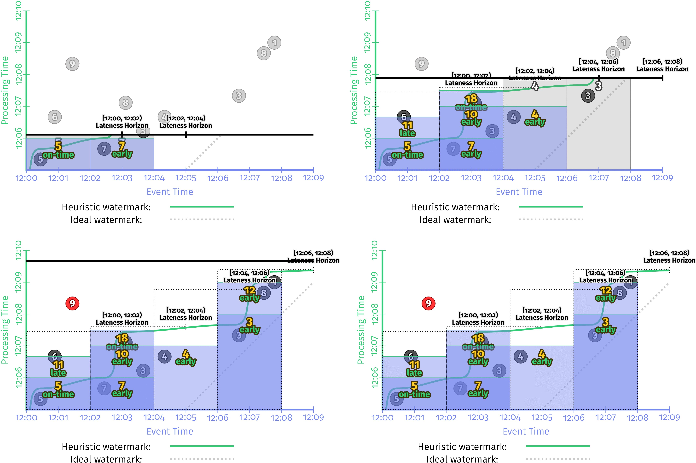

**allowed latenessに関する2つの重要ポイント：**
- データが完璧なwatermark、つまり順序が保証されている場合は、allowed latenessの問題を考慮する必要はありません。
- 限られたキーに対してグローバル集約を行う場合は、allowed latenessの問題を考慮する必要はありません。（部分的なグローバル集約、例えばsumやaggなどは増分計算が可能であり、すべてのデータを保存する必要はありません。）

## 5、How: Accumulation
レイトイベントに遭遇した場合、ウィンドウの以前の出力結果をどのように修正するかには、以下の3つの方法があります：

- **Discarding（破棄）：** 
  各ウィンドウが出力を生成した後、その状態はすべて破棄されます。つまり、各ウィンドウは完全に独立しています。この方法は、整数の合計など、下流が集約処理の場合に適しています。

- **Accumulating（累積）：** 
  すべてのウィンドウの履歴状態が保存され、レイトイベントが到着するたびに再計算がトリガーされ、以前の計算結果が更新されます。この方法は、HBaseや主キー付きRDSテーブルなどの可更新データストレージが下流にある場合に適しています。

- **Accumulating & Retracting（累積と撤回）：** 
  Accumulatingは第2点と同様に、ウィンドウのすべての履歴状態を保持します。撤回は、遅延イベントが到着した後、再計算するだけでなく、以前のウィンドウの出力を撤回します。 
  以下の2つのケースに非常に適しています：
    - ウィンドウの下流がグループ化ロジックであり、グループ化キーが変更された場合、遅延イベントの最新データが届いた後、以前のデータと同じグループに属しているとは限らないため、以前の結果を撤回する必要があります。
    - 動的ウィンドウでは、ウィンドウが結合されるため、以前のウィンドウがどの下流ウィンドウに割り当てられたかを把握することは困難です。そのため、以前の結果を撤回する必要があります。

例として、[12:02,12:04]のウィンドウの出力結果を3つのモードで比較してみましょう：

|                      | Discarding | Accumulating | Accumulating& Retracting |
|----------------------|------------|--------------|--------------------------|
| Pane 1: inputs=[7,3] | 10         | 10           | 10                       |
| Pane 2: inputs=[8]   | 8          | 18           | 18, -10                  |
| Last NormalValue     | 8          | 18           | 18                       |
| Total Sum            | 18         | 28           | 18                       |

1) Discarding（破棄）：同じウィンドウの各出力は、以前の出力と完全に独立しています。この例では、合計を計算するためには、ウィンドウの各出力を合算するだけで済みます。したがって、Discardingモードは下流が集計（SUM/AGG）などのシナリオに非常に適しています。
2) Accumulating（累積）：ウィンドウは以前のすべての状態を保存するため、同じウィンドウの各出力は、以前のすべてのデータの累積値です。この例では、ウィンドウの最初の出力は10、2回目の入力は8で、以前の状態は10ですので、出力は18です。下流の計算で2回の出力を合算すると、結果は誤りになります。

~~~
//Discarding mode version of early/on-time/late firings
PCollection<KV<String, Integer>> scores = input.apply(Window.into(FixedWindows.of(Duration.standardMinutes(2))
  .triggering(AfterWatermark.pastEndOfWindow()
          .withEarlyFirings(AfterProcessingTime.pastFirstElementInPane().plusDelayOf(Duration.standardMinutes(1)))
          .withLateFirings(AfterPane.elementCountAtLeast(1)))
  .withAllowedLateness(Duration.standardDays(1000))
  .discardingFiredPanes())
.apply(Sum.integersPerKey());
~~~
ヒューリスティック水印を使用すると、ストリーム処理エンジンでの上記コードに対応する時系列チャートは以下の通りです：

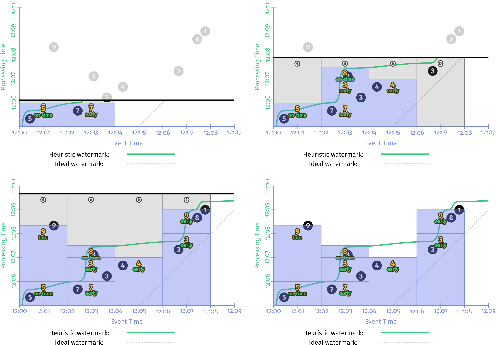
